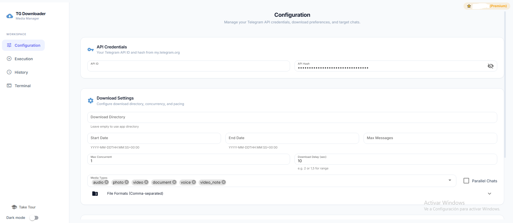
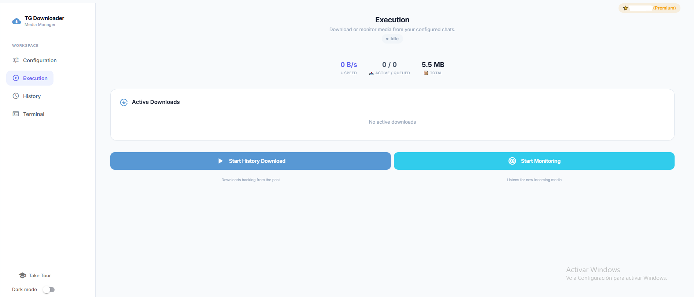
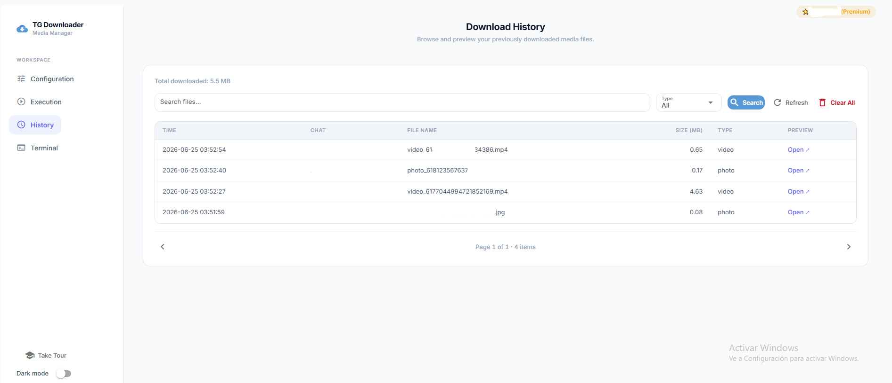
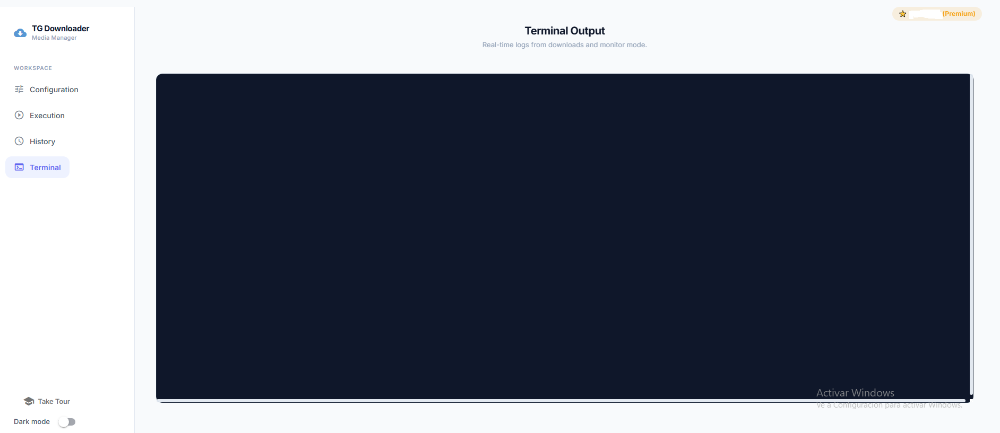

<h1 align="center">Telegram Media Downloader</h1>

<p align="center">
<a href="https://app.deepsource.com/gh/xodaaaa/telegram_media_downloader"></a>
<a href="https://github.com/xodaaaa/telegram_media_downloader/blob/master/LICENSE"></a>
<a href="https://github.com/python/black"></a>
</p>

Download all media files (audio, document, photo, video, voice, video_note)
from Telegram chats and channels. Tracks progress so you never re-download
the same file twice. **Python 3.8+** · CLI + Web UI.

---

## 🚀 Quick Start

```sh
git clone https://github.com/xodaaaa/telegram_media_downloader.git
cd telegram_media_downloader
pip install -r requirements.txt    # CLI only
pip install -r requirements-webui.txt  # + Web UI (Python 3.10+)

python webui.py                    # Opens http://localhost:8080
```

The **Setup Wizard** guides you through API credentials, phone verification,
and target chat selection. No manual config editing needed.

---

## 📋 First-Time Setup (Wizard)

On first run, the Web UI detects what's missing and guides you:

| Step | What you need | Where to get it |
|---|---|---|
| **API Credentials** | `api_id` (number) + `api_hash` (string) | [my.telegram.org/apps](https://my.telegram.org/apps) |
| **Phone Verification** | Your phone number + SMS code | Sent to your Telegram account |
| **Target Chat** | Chat ID or @username | [@RawDataBot](https://t.me/RawDataBot) on Telegram |

After the wizard, your `config.yaml` is created automatically with safe
defaults (`download_delay: [15, 30]`, all media types enabled).

If you already have a session, the wizard skips to only what's missing.

---

## 💻 Installation

### Windows
```sh
git clone https://github.com/xodaaaa/telegram_media_downloader.git
cd telegram_media_downloader
pip install -r requirements.txt
pip install -r requirements-webui.txt
python webui.py
```

### Linux / macOS
```sh
git clone https://github.com/xodaaaa/telegram_media_downloader.git
cd telegram_media_downloader
make install          # CLI only
make install_webui    # + Web UI
python3 webui.py
```

---

## ⚙️ Configuration (`config.yaml`)

| Option | Default | Description |
|---|---|---|
| `api_id` | — | Your Telegram API ID |
| `api_hash` | — | Your Telegram API hash |
| `mode` | `history` | `history` (backlog) · `monitor` (live) · `history_monitor` (both) |
| `chat_id` | — | Target chat/channel (can also use `chats:` list) |
| `media_types` | all 6 | `audio`, `document`, `photo`, `video`, `voice`, `video_note` |
| `download_delay` | `[15, 30]` | Seconds between files. Number for fixed, `[min, max]` for random, `null` to disable |
| `max_concurrent_downloads` | `4` | Simultaneous downloads per batch |
| `download_directory` | project folder | Custom download path |

> Full schema in `config.yaml.example`. All options can be overridden per-chat.

---

## ▶️ Execution Modes

Set `mode` in `config.yaml`, or use the Execution tab buttons:

| Mode | CLI command | What it does |
|---|---|---|
| **history** (default) | `python media_downloader.py` | Downloads backlog, then exits |
| **monitor** | (set `mode: monitor`) | Listens for new messages in real time |
| **history_monitor** | (set `mode: history_monitor`) | Backlog first, then auto-switches to monitor |

All modes respect `download_delay` and `max_concurrent_downloads`.

---

## 🖥️ Web UI Tabs

| Configuration | Execution |
|---|---|
|  |  |

| History | Terminal |
|---|---|
|  |  |

---

## ⌨️ CLI

```sh
python media_downloader.py
```

Reads `config.yaml`, downloads media, saves progress. Supports all 3 modes.
Press `Ctrl+C` to stop gracefully (progress is saved).

---

## 📁 Download Directories

| Media Type | Path |
|---|---|
| `photo` | `{download_directory}/photo/` |
| `video` | `{download_directory}/video/` |
| `audio` | `{download_directory}/audio/` |
| `document` | `{download_directory}/document/` |
| `voice` | `{download_directory}/voice/` |
| `video_note` | `{download_directory}/video_note/` |

Files are organized inside a `chat_id` subfolder by default:

```
downloads/
 └── 8994582612/
     ├── photo/
     ├── video/
     └── audio/
```

---

## 🔒 Proxy

Add to `config.yaml` (optional):

```yaml
proxy:
  scheme: socks5
  hostname: 11.22.33.44
  port: 1234
  username: your_username    # optional
  password: ${PROXY_PASSWORD}    # optional
```

Supports `socks4`, `socks5`, `http`.

---

## 🤝 Contributing

- [Report a bug](https://github.com/xodaaaa/telegram_media_downloader/issues)
- [Feature request](https://github.com/xodaaaa/telegram_media_downloader/discussions/categories/ideas)
- [Contributing guidelines](https://github.com/xodaaaa/telegram_media_downloader/blob/master/CONTRIBUTING.md)
- [Code of Conduct](https://github.com/xodaaaa/telegram_media_downloader/blob/master/CODE_OF_CONDUCT.md)
